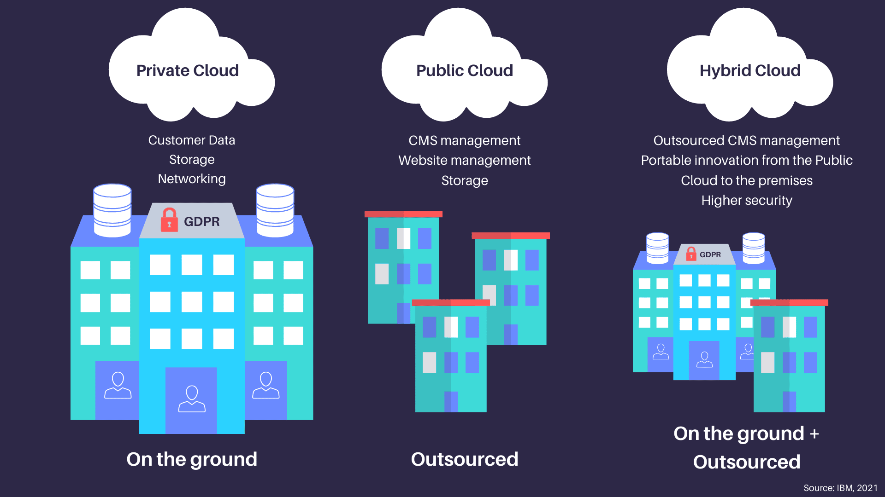
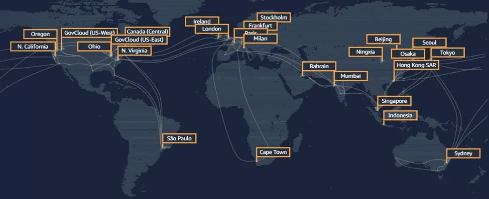

#U1 - Introducció al núvol i a AWS

**🎯 RA's vinculats**: RA1 i RA2

## ☁️ Què és la computació al núvol?

La **computació al núvol** (*cloud computing*) és la distribució de serveis informàtics a través d’internet: servidors, emmagatzematge, bases de dades, xarxes, programari, anàlisi i molt més.

Permet **accedir als recursos de manera remota, sota demanda i pagant només pel que s'utilitza**.

📌 Aquesta tecnologia ha canviat la manera com les empreses desenvolupen, despleguen i mantenen les seues aplicacions.

---

### 🔁 Diferències amb el model tradicional (*on-premise*)

En un model tradicional, l’empresa ha de:

- Comprar maquinari i llicències de programari
- Instal·lar i configurar servidors
- Gestionar manteniment físic i actualitzacions
- Assumir costos inicials elevats

Amb el núvol:

- Els recursos s’utilitzen com un servei, com si foren llogats
- Es paga segons l’ús (com una factura d’aigua o electricitat)
- S’elimina la necessitat de manteniment físic

_Infraestructura tradicional vs. computació al núvol - Font: softexpert_

---

## 🧩 Característiques principals del núvol

1. **Escalabilitat**
    - Els recursos poden créixer o reduir-se automàticament segons les necessitats (per exemple, més servidors si augmenta el trànsit web).
    - L’escalabilitat pot ser vertical (millorar una màquina) o horitzontal (afegir més màquines).

2. **Elasticitat**
    - Capacitat per adaptar-se en temps real a canvis de demanda. L’elasticitat sol ser temporal i automàtica.

3. **Alta disponibilitat**
    - Els serveis es distribueixen entre múltiples ubicacions físiques per garantir que continuen funcionant fins i tot si hi ha fallades.

4. **Model de pagament per ús**
    - L’usuari només paga pels recursos utilitzats: hores de computació, GB d’emmagatzematge, transferència de dades, etc.

5. **Accés global**
    - Es pot accedir als recursos des de qualsevol lloc del món, sempre que es tinga connexió a Internet.

6. **Gestió delegada**
    - El proveïdor del núvol s'encarrega del manteniment, seguretat física, actualitzacions i monitoratge.

!!! note "Exemple real"
    Imagina una empresa que llança una nova aplicació mòbil. Amb el núvol:  
        - Pot començar amb pocs recursos.  
        - Si té èxit i creix el nombre d’usuaris, el sistema escala automàticament.  
        - Si la campanya acaba, redueix recursos i costos automàticament.

!!! note "Exemple real"
    Imagina una empresa que ven entrades per a esdeveniments:  
        - De normal, la web té un tràfic de 2000 persones simultànies.  
        - De repent, Bad Bunny decideix vendre entrades a través d'aquesta plataforma.  
        - En una infraestructura on-premise, no seria viable ja que no tindrien capacitat.  
        - Gràcies al núvol, poden contractar més capacitat de còmput durant unes hores o dies i després tornar a la normalitat.

---

## 🧱 Models de servei: IaaS, PaaS, SaaS

La computació al núvol es divideix segons **el nivell de control** i responsabilitat que té l’usuari:

---

### 🖥️ IaaS (Infrastructure as a Service)

**Què ofereix?**  
Infraestructura virtualitzada: servidors, discos, xarxes, etc.

**L’usuari controla:**  
El sistema operatiu, aplicacions, configuracions, actualitzacions.

📌 **Exemples en AWS:** EC2, EBS, VPC, Elastic Load Balancing

✅ Ideal per a:  
- Administradors de sistemes  
- Desenvolupadors que necessiten control total

---

### 🛠️ PaaS (Platform as a Service)

**Què ofereix?**  
Una plataforma preparada per executar aplicacions, sense preocupar-se de la infraestructura.

**L’usuari controla:**  
Només el codi i la configuració de l'aplicació.

📌 **Exemples en AWS:** Elastic Beanstalk, AWS Lambda (amb matisos)

✅ Ideal per a:  
- Desenvolupadors que volen centrar-se en el codi  
- Prototipat ràpid d'aplicacions

---

### 💻 SaaS (Software as a Service)

**Què ofereix?**  
Aplicacions llestes per utilitzar a través d’Internet.

**L’usuari controla:**  
Només l’ús del servei. No cal instal·lar, configurar ni actualitzar res.

📌 **Exemples en AWS:** Amazon WorkMail, Amazon Chime  
📌 **Altres exemples:** Google Docs, Dropbox, Micros

_Comparativa models - Font: zscaler_

!!!note "Metàfora amb una casa"
    - **IaaS**: Llogues una casa buida. Tu portes mobles, cuines i la neteges.
    - **PaaS**: Llogues una casa moblada. Tu només cuines i vius.
    - **SaaS**: Vas a un hotel amb tot inclòs.

---

## 🌐 Models de desplegament: Públic, Privat i Híbrid

---

### 🔓 Núvol públic

Els recursos s’allotgen en centres de dades d’un proveïdor (com AWS) i es comparteixen entre múltiples clients.

✅ Avantatges:  
- Menor cost inicial  
- Escalabilitat immediata  
- Manteniment a càrrec del proveïdor  

📛 Desavantatges:  
- Menys control directe  
- Possibles preocupacions de privadesa en entorns regulats  

---

### 🔐 Núvol privat

Infraestructura dedicada exclusivament a una sola organització.

Pot estar allotjada:  
- A les instal·lacions de l’empresa  
- O gestionada per un proveïdor en un entorn dedicat  

✅ Avantatges:  
- Major control, seguretat i personalització

📛 Desavantatges:  
- Costos més alts  
- Escalabilitat i flexibilitat limitada  

---

### 🌩️ Núvol híbrid

Combinació de núvol privat i públic. Permet aprofitar el millor de cada món.

✅ Exemple:  
- L’empresa manté dades sensibles en núvol privat  
- I utilitza el núvol públic per a càrregues de treball temporals  

_Públic vs Privat vs Híbrid - Font: abusix_

---

## 🚀 Introducció a AWS

**Amazon Web Services (AWS)** és el líder mundial en serveis al núvol, amb milers de milions de dòlars d’infraestructura distribuïda globalment.

📌 Fundada en 2006, ofereix **més de 200 serveis** que cobreixen tots els àmbits del desenvolupament informàtic: còpia de seguretat, IA, anàlisi de dades, desplegament web, etc.

!!!note "Sabies què Amazon guanya més diners amb AWS que amb la seua tenda?"
    Encara que Amazon és conegut per la majoria de la població per la seua tenda online, el **61,4%** dels seus beneficis provenen de AWS i tan sols el **38,6%** restant provenen de la tenda.

_Infraestructura global d’AWS - Font: salesforce_

### 🔧 Serveis fonamentals que es treballaran durant el curs

| Servei | Funció principal |
|--------|------------------|
| EC2 | Servidors virtuals |
| S3 | Emmagatzematge d’objectes |
| IAM | Gestió d’usuaris i permisos |
| RDS | Bases de dades relacionals |
| Lambda | Execució de codi sense servidor |

> 💬 **Curiositat**  
> Netflix, NASA, BMW, i moltes start-ups utilitzen AWS per al seu funcionament diari.

---
!!! tip "Pràctica sugerida"
    En aquest punt, es recomana fer les [pràctiques de la unitat 1](u1_practiques.md) per tindre un primer contacte amb la plataforma.

!!! tip "Curs AWS Academy Cloud Foundations "
    Una vegada dins d'AWS (cal fer les pràctiques abans), es recomana realitzar el mòdul 0 (*Introducción al curso*) i el mòdul 1 (*Información general sobre conceptos de la nube*) del curs de *AWS Academy Cloud Foundations*.

