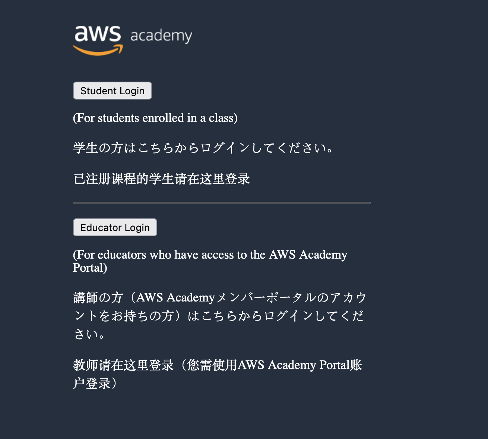

!!! note "IMPORTANT"
    Aquestes pràctiques no són obligatòries, però sí recomanables per a poder realitzar els entregables (Aules).

---

## Pràctica 1 - Primer contacte amb AWS ☁️

!!! note "IMPORTANT"
    Aquesta pràctica no podràs fer-la fins que el professor no et done d'alta a AWS Academy.

Primer accés a l’entorn de laboratori
Accés a l’entorn d’AWS Academy (AWS Educate).
Primer inici de sessió a la consola.
Exploració inicial de la interfície: menú de serveis, barra de cerca, regions.
Identificació dels serveis més visibles (EC2, S3, IAM, RDS, Lambda).

### 🔐 1. Accés al portal d’AWS Academy

**Objectiu:**  
Entendre com accedir al curs i iniciar sessió en l'entorn virtual proporcionat per AWS Academy.

**Instruccions detallades:**

1. Accedeix a 👉 [https://awsacademy.instructure.com](https://awsacademy.instructure.com)  
2. Inicia sessió seleccionant **Student Login** amb el teu **usuari i contrasenya** (el/la professor/a facilitarà les credencials o l’enllaç d’inscripció).  

3. La pàgina principal és el **Dashboard de AWS**. Ací, podràs vore tots els cursos que tens disponible per a realitzar. Per començar, deuries vore el curs **AWS Academy Cloud Foundations**. 
4. Accedeix a la secció **Modules (Mòduls)**.  
5. En el primer mòdul, busca el primer laboratori (pot tindre un nom com ara:  
   `Getting Started with AWS`, `Introduction to AWS Console`, o similar).  
6. Fes clic al botó `Start Lab`.

> 💡 **Bloc informatiu**  
> Quan faces clic a `Start Lab`, s’obrirà una finestra amb un *dashboard* del laboratori.  
> En aquest *dashboard* apareixeran les **credencials temporals** per accedir a AWS:
>
> - L’enllaç a la consola de AWS  
> - Un **nom d’usuari temporal**  
> - Una **contrasenya temporal**  
>
> ⚠️ *No cal crear un compte d’AWS ni utilitzar el teu correu personal.*

📷 **Imatge suggerida:**  
Captura del *dashboard* del laboratori, on es veuen les credencials temporals.

---

### 🧭 2. Navegació inicial per la consola d’AWS

**Objectiu:**  
Familiaritzar-se amb la interfície de la consola d’AWS i entendre la jerarquia de serveis.

**Instruccions detallades:**

1. Obri la **Consola d’AWS** utilitzant les credencials temporals que t’ha proporcionat el laboratori.  
2. Observa els elements principals de la interfície:
   - ✅ La **barra superior** (servicis recents, botó d'ajuda, usuari actual)
   - ✅ El **selector de regió** (per defecte, sol estar a `N. Virginia`)
   - ✅ El **panell de serveis** (botó `Services` en la part superior esquerra)

3. Fes clic al menú `Services` i explora breument aquestes seccions:
   - **Compute** → on trobaràs el servei `EC2`
   - **Storage** → on apareix el servei `S3`
   - **Security, Identity & Compliance** → on trobaràs `IAM`

> 🎯 **Repte**  
> Troba el servei **EC2**, fes clic i identifica les opcions del panell esquerre (Instances, Volumes, Key pairs...).  
> Fes el mateix amb **S3** i **IAM**. Anota quines opcions apareixen en cadascun.

📷 **Imatge suggerida:**  
Captura de pantalla de la consola principal d’AWS destacant:
- El **selector de regió**
- El botó `Services`
- La barra superior amb l’usuari i l’ajuda

---

### 🧭 3. Canvi d’idioma i configuració de la interfície (opcional)

**Objectiu:**  
Fer més accessible la consola d’AWS canviant l’idioma i revisant les opcions bàsiques de configuració.

**Instruccions detallades:**

1. A la barra superior, fes clic sobre el teu nom d’usuari (dreta de tot).  
2. Selecciona `Settings`.  
3. Busca l’opció `Language` i selecciona **Español** o **Català** si està disponible (depenent de la versió de la consola).  
4. Guarda els canvis.

> ℹ️ **Nota:** El canvi d’idioma no afecta les funcionalitats, només l’idioma de la interfície.

---

### ✅ Entrega (si cal)

Quan hages completat totes les passes anteriors:

- Fes una **captura de pantalla** de la consola d’AWS on es veja:
  - El teu nom d’usuari temporal
  - La regió activa
  - El panell de serveis
- Guarda la imatge com a PDF o inclou-la en un document que entregaràs per l’aula virtual segons les indicacions del professorat.

---

