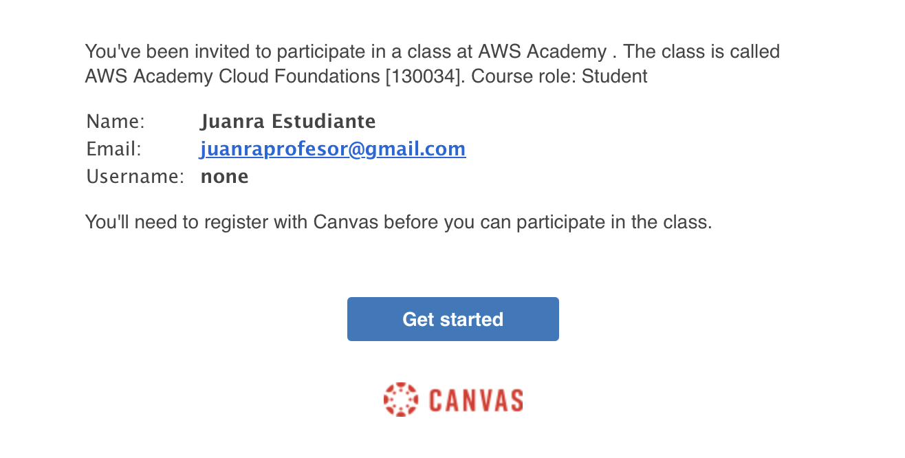
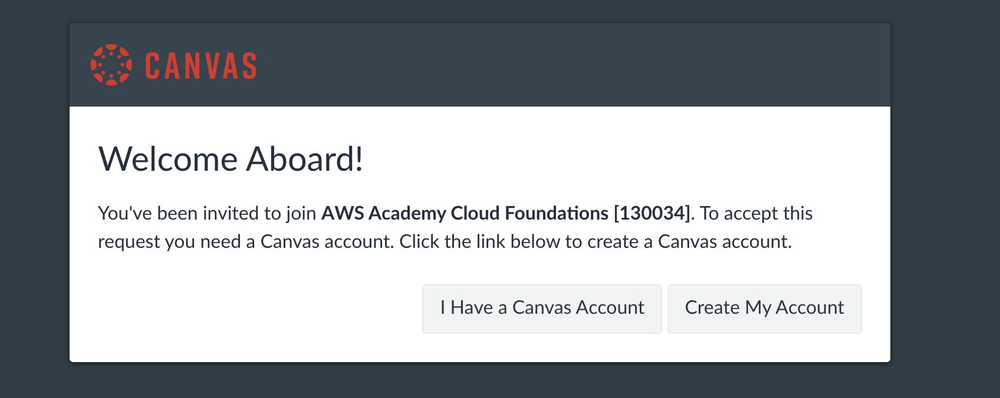
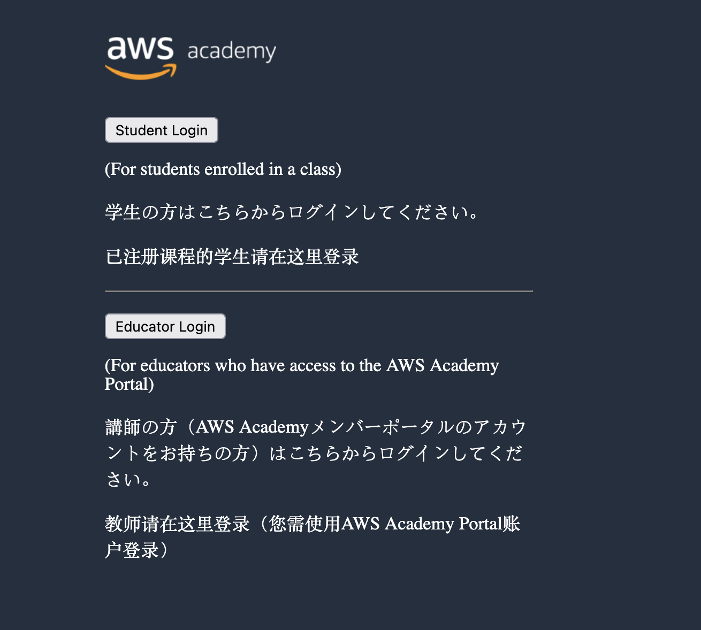
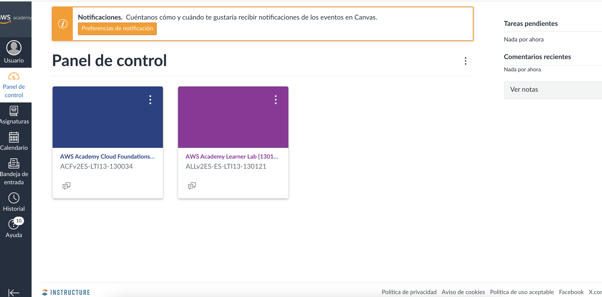
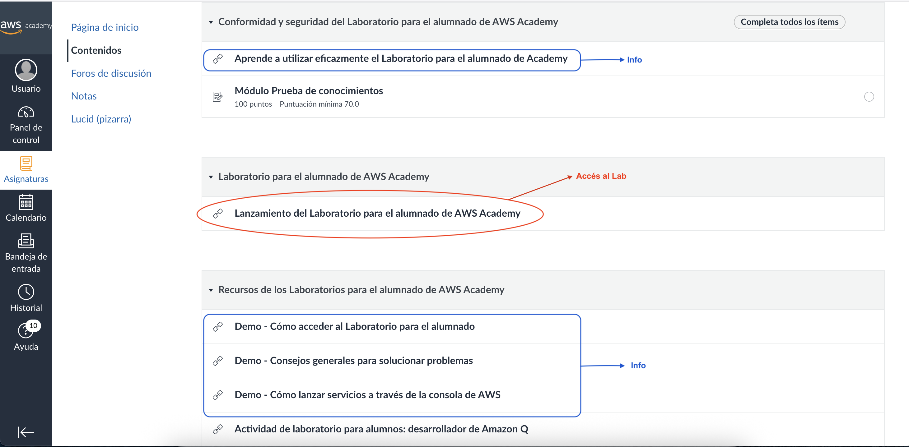
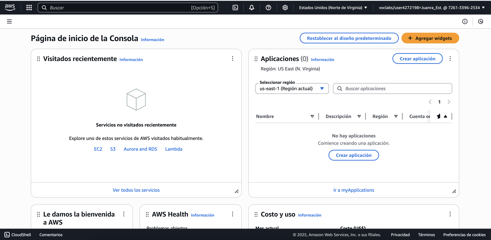
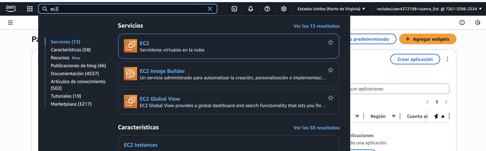

!!! note "IMPORTANT"
    Aquestes pràctiques no són obligatòries, però sí recomanables per a poder realitzar els entregables (Aules).

---

## Pràctica 1 - Primer contacte amb AWS ☁️

!!! note "IMPORTANT"
    Aquesta pràctica no podràs fer-la fins que el professor no et done d'alta a AWS Academy.

Primer accés a l’entorn de laboratori
Accés a l’entorn d’AWS Academy (AWS Educate).
Primer inici de sessió a la consola.
Exploració inicial de la interfície: menú de serveis, barra de cerca, regions.
Identificació dels serveis més visibles (EC2, S3, IAM, RDS, Lambda).

### 🔐 1. Accés al portal d’AWS Academy

1.  Hauràs rebut un correu com aquest al correu associat a la teua identitat digital **(@gva.es)**. Si no ho has fet, posa't en contacte amb el professor.  
    Si  el problema el tens amb les credencials per accedir al correu de la teua identitat digital, hauràs de consultar-ho amb **secretaria del centre** o el **tutor o tutora**.
  

2.  Al fer click en el botó del correu, ens portarà a la web de **Canvas** (no confundir amb Canva, gastada per fer dibuixets), plataforma que es gasta per autenticació dins d'**AWS Academy**, des d'on seleccionarem que no tenim compte i configurarem el nostre propi.  

    **📝 Guarda bé les credencials** (correu i contrasenya). Perdre l'accés pot suposar no tindré accés en dies o inclús setmanes 
  

3.  Una vegada tot configurat, accedirem al **Dashboard de AWS**.  Per a les properes conexions, es deu accedir des de 👉 [https://awsacademy.instructure.com](https://awsacademy.instructure.com)  i iniciar sessió seleccionant **Student Login** amb el teu **usuari i contrasenya**. 
  

4.  La pàgina principal és el **Dashboard de AWS**. Ací, podràs vore tots els cursos que tens disponible per a realitzar. Per començar, deuries vore el curs **AWS Academy Cloud Foundations**. 
  

5.  Inicialment, tindrem sols aquest curs. Com pots vore al menú lateral, aquest conté una secció anomenada **Modules** que ens permet accedir al contingut del curs. A nosaltres de moment no ens interessa aquest contingut ja que farem les nostres pròpies pràctiques però si és del vostre interés, podeu anar xafardejant les diferents seccions. 

6.  Certs mòduls contenen un laboratori. En la següent pràctica explicarem què són, per a què serveixen i què hem de tindre en compte per treballar amb ells.

---

# Pràctica 2 - Laboratoris en AWS
## ❓Què és un AWS Academy Learner Lab?
Un **AWS Academy Learner Lab** és un entorn pràctic a la plataforma de núvol Amazon Web Services (AWS) dissenyat especialment per a estudiants. En aquest laboratori, podràs experimentar i posar en pràctica els coneixements sobre serveis d’informàtica en el núvol de forma segura, controlada i sense risc de gastar diners reals.

Cada alumne disposa d’un crèdit virtual i d’uns permisos limitats, que li permeten crear, gestionar i eliminar recursos d’AWS (com màquines virtuals, bases de dades, emmagatzematge, etc.), seguint les activitats i pràctiques que proposa el professorat.

!!! note "Abans de començar a treballar amb laboratoris, és **imprescindible conéixer** els següents punts"

    1. AWS té molts **serveis gratuïts** per a l’alumnat, però alguns, com les IPs elàstiques (IPs fixes) o certs serveis, *costen* diners. En properes unitats s'explicarà en més detall la facturació.
    2. **Disposem d'un crèdit de 50$** per a poder gastar en els seus serveis. Estos 50 $ han de durar-nos **tot el curs** i per això, **SEMPRE** quan acabem de treballar amb el laboratori, **el detindrem**. **SEMPRE. SENSE EXCEPCIÓ**.
    3. Cada sessió al Lab té una **duració de 4 hores** des de que fem click a *Start Lab*. Una vegada passa aquest temps, la sessió acaba però els recursos no es borres (però poden ser detinguts). Si necessitem més temps, simplement fem click a *Start Lab* de nou i seguirem treballant al laboratori.
    4. Els labs tenen les **regions restringides** a us-east1 i us-west-2. En la següent unitat s'explicarà en més detall les regions.
    5. Les **AMI's** (imatges per a les màquines virtuals) **estan restringides** no podent gastar-se les del marketplace.
    6. Les instàncies EC2 (màquines virtuals) inicien cada sessió en una **IP diferent** (a no ser que gastem ip's elàstiques).
    7. Si intentem tindre 20 o més instàncies iniciades ens **desactivaran el compte i es borraran tots els recursos**, perdent tot el progrés del laboratori.

**L'accés al Lab** es realitzarà de la mateixa forma que hem vist a la pràctica 1. Es a dir, rebrem un correu dient-nos que se'ns ha convidat a un Learner Lab i una vegada acceptem veurem el **Lab al nostre Dashboard**.
  

Si accedim a l'apartat de continguts, trobarem **l'enllaç per accedir al lab** juntament d'informació d'utilitat per al seu ús.
!!!note "Cal llegir la documentació oficial"
    Com a bons informàtics, hem d'acostumar-se a **sempre** llegir la referència i documentació oficial de les ferramentes que anem a gastar.
  

Una vegada dins del lab i després d'haver acceptat les condicions d'ús, ens trobarem al que anomenarem *quadre de control del lab* i qué varies parts que cal entendre bé.
  

1. **Estat del lab** - Ens indica l'estat del lab (encés o apagat) i a més és l'enllaç a la plataforma d'AWS associada al lab, es a dir, a l'entorn de treball d'AWS (associat al lab)
2. **Crèdit disponibles** - Aquest apartat sols apareix una vegada està el lab encés. Ens indica quants crèdits hem gastar del total disponible. Si fem les coses bé, sols gastarem crèdit en algunes pràctiques específiques. 
3. **Start lab** - Inicia la sessió de treball al laboratori. Passa l'estat del lab a *encés*.
4. **Stop lab** - Tanca la sessió de treball al laboratori. Passa l'estat del lab a *apagat*. Recorda que parar el lab no implica que es vaja a eliminar el treball que hem realitzar i que és, en el nostre cas, **OBLIGAT** apagar el lab sempre que acabem de treballar. D'aquesta forma, en cas que tingam algun servei consumint-nos crèdits, deixarà de fer-ho. 
5. **AWS details** - Mostrarà les dades d'accés al lab per a poder connectar-se des de una terminal remota local. De moment, gastarem la terminal integrada.
6. **Reset lab** - Eliminarà tot el que tenim fet al laboratori. Aquest botó el gastarem quan estem segurs que ja hem finalitzat amb la pràctica i que no necessitem el que hem fet per a la següent. 

Una vegada hem iniciat el lab amb *Start Lab* i l'estat estiga en verd, si fem click al botó *AWS(1)* accedirem a l'entorn de treball d'AWS i veurem algo semblant al següent:
  

Aquest és el punt d'entrada de l'entorn de treball d'AWS i conté moltes seccions que anirem treballant durant les diferents unitats.  

A la part superior, trobem un **buscador** on podrem trobar els diferents serveis que composen AWS com, per exemple, el de màquines virtuals, anomenat EC2, així com altres serveis importants com S3 o RDS, entre d'altres. A més, també podem veure informació interessant com la regió en la que ens trobem o l'idioma en el que tenim la plataforma dins de l'opció de configuració.
  

Una vegada hem pogut accedir tant al curs creat com al lab, estem preparats per afrontar les següents unitats on s'agafarà com a punt de partida el laboratori en el seu estat inicial i s'aniran vent diferents serveis de la plataforma.

---
