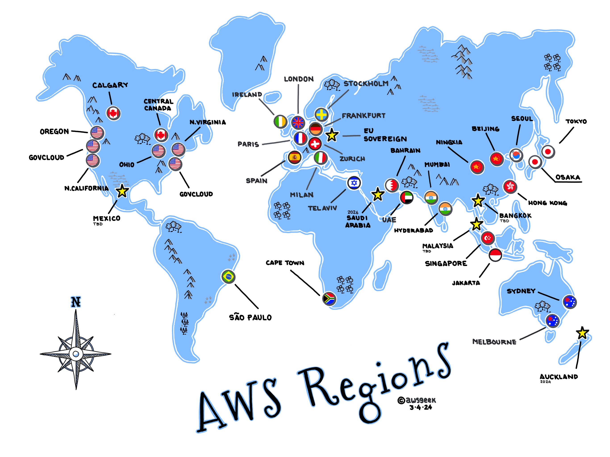

# U2 - 🌍 Infraestructura global i serveis bàsics: EC2 i seguretat inicial

**🎯 RA's vinculats**: RA1, RA2, RA3

## Infraestructura global d’AWS

AWS és una de les plataformes de núvol més grans del món i es desplega de manera distribuïda per garantir alta disponibilitat, redundància i baixes latències:

- Regions: zones geogràfiques (ex: eu-west-1 a Irlanda).
- Zones de disponibilitat (AZs): cada regió té diverses AZs, que són centres de dades independents però interconnectats

---

### Regions

Una regió d’AWS és una zona geogràfica gran que conté múltiples centres de dades. Cada regió rep un codi identificador, com ara:

- us-east-1 → Virgínia del Nord

- eu-west-1 → Irlanda

- southeast-1 → Singapur

_Regions AWS - Font: awsgeek_

En [aquest enllaç](https://aws.amazon.com/es/about-aws/global-infrastructure/regions_az/) podeu trobar la informació oficial actualizada sobre les regions

---

#### 🧩 Característiques d’una regió
- **Separació geogràfica**: cada regió està en un país o àrea concreta.

- **Compliment legal i normatiu**: algunes empreses han de mantindre dades dins del seu territori (ex: dades mèdiques a la UE).

- **Latència**: com més prop estiga la regió dels usuaris finals, més ràpida serà la resposta.

- **Redundància**: si una regió falla (molt poc probable), altres regions poden assumir la càrrega.

- **Disponibilitat de serveis**: no totes les regions tenen els mateixos serveis.

!!! note "Exemple pràctic"
    - Una startup de videojocs a València que té la majoria d’usuaris a Espanya hauria de triar eu-west-1 (Irlanda) o eu-south-2 (Madrid) per a minimitzar latència.
    - Una empresa multinacional podria desplegar en diverses regions per a apropar els serveis als clients d’Amèrica, Europa i Àsia.

---

### Zones de disponibilitat (AZs)

Dins de cada regió hi ha entre 2 i 6 zones de disponibilitat (Availability Zones o AZs).

Una AZ és un centre de dades independent, amb:

- Subministrament elèctric propi.
- Xarxa i connectivitat redundants.
- Sistemes de refrigeració i seguretat físics independents.

_Zones de disponibilitat de la regió us_west - Font: w3schools_

#### Per què és important?
**1. Alta disponibilitat:** si una AZ cau per manteniment o desastre, les altres continuen actives.

**2. Replicació:** bases de dades i aplicacions poden estar replicades entre AZs.

**3. Disaster recovery:** es poden dissenyar arquitectures tolerants a fallades.

!!! note "Exemple "
    - Una aplicació web pot desplegar dos servidors EC2: un en eu-west-1a i un altre en eu-west-1b. Si cau una AZ, l’altra continua donant servei.

#### Regions vs AZs

| **Aspecte** | **Regions**                                      | **AZs**                          |
| ----------- | ------------------------------------------------ | -------------------------------- |
| Abast       | Geogràfic (país o àrea)                          | Centre de dades dins de la regió |
| Objectiu    | Compliment legal, latència, proximitat a usuaris | Disponibilitat i redundància     |
| Quantitat   | 30+ regions a nivell mundial                     | 2–6 AZs per regió                |
| Exemple     | `eu-west-1` (Irlanda)                            | `eu-west-1a`, `eu-west-1b`       |

#### I com trie quina regió gastar?
Quan desplegues serveis a AWS has de pensar:

- Latència: prop dels usuaris finals.

- Compliment normatiu: per exemple, GDPR a Europa.

- Costos: no totes les regions costen igual. (Ex: us-east-1 és més barat que eu-west-1).

- Disponibilitat de serveis: algunes regions tenen serveis nous abans que altres.

- Estratègia de negoci: pot interessar desplegar en diverses regions per motius comercials.

> 📋 **Activitat opcional**  
> Reflexiona sobre el següent:
> - Per què creus que AWS ens deixa seleccionar la Regió i AZ però no el data center?
> - Si tingueres una startup espanyola, en quina regió desplegaries i per què? I una ONG africana? I una empresa japonesa?

!!! tip "Pràctica sugerida"
    En aquest punt dels continguts, es recomana fer la [pràctica 1 de la unitat 2](u2_practiques.md).

!!! tip "Curs AWS Academy Cloud Foundations "
    En aquest punt es recomana realitzar el mòdul 3 (*Información general sobre la infraestructura global de AWS*) del curs d' *AWS Academy Cloud Foundations*.

---
## Model de responsabilitat compartida

AWS assegura la infraestructura física i del núvol, mentre que el client és responsable de la configuració i l’ús correcte.

| **Responsabilitat d’AWS**  | **Responsabilitat del client**              |
| -------------------------- | ------------------------------------------- |
| Centres de dades físics    | Gestió d’usuaris (IAM)                      |
| Xarxa global               | Configuració de firewalls (Security Groups) |
| Maquinari i virtualització | Xifrat de dades i claus                     |
| Disponibilitat de serveis  | Instal·lació de programari i parches        |

### Errors habituals dels clients

- Deixar ports oberts a Internet (ex: 0.0.0.0:22).

- Utilitzar usuaris root per defecte.

- No configurar còpies de seguretat.

!!! info "Cas real"
    L’empresa Capital One va patir una filtració de dades per una configuració errònia d’un Security Group en AWS. AWS no va ser el culpable: era responsabilitat del client. [Enllaç a la notícia](https://www.appsecengineer.com/blog/aws-shared-responsibility-model-capital-one-breach-case-study)

> 📋 **Activitat opcional**  
> Revisa la documentació sobre la responsabilitat compartida que ofereix [AWS](https://aws.amazon.com/es/compliance/shared-responsibility-model/) i digues qui és el responsable (AWS o client) en le següents situacions:

> - Fallada elèctrica en un centre de dades.
> - Hacker accedint per una contrasenya dèbil.
> - Servidor lent perquè no té prou CPU.
> - Error de maquinari en un disc dur.

!!! tip "Curs AWS Academy Cloud Foundations "
    En aquest punt es recomana realitzar fins la secció 1 (*Modelo de responsabilidad compartida de AWS*) del mòdul 4 (*Seguridad en la nube*) del curs d' *AWS Academy Cloud Foundations*.
---

## IAM: usuaris, grups i rols

En qualsevol infraestructura al núvol, la seguretat és un pilar fonamental. A AWS, aquesta gestió d’identitats i permisos es fa a través del servei IAM (Identity and Access Management). IAM ens permet controlar qui pot accedir als nostres recursos, amb quins permisos i sota quines condicions.

El primer que hem d’entendre és que en AWS hi ha dos grans tipus d’identitats:

- **Usuaris i grups**: representen persones que accedeixen al sistema (administradors, estudiants, desenvolupadors, etc.).

- **Rols**: representen aplicacions o serveis (com una instància EC2) que necessiten permisos temporals per a funcionar.

Gràcies a IAM podem aplicar el principi de mínim privilegi, és a dir, donar a cada entitat només els permisos estrictament necessaris. Això redueix el risc d’errors i atacs.

### Usuaris i grups

Un **usuari** és una identitat individual dins d’AWS. Pot tindre credencials d’accés a la consola (usuari i contrasenya), o bé claus d’accés per a utilitzar la CLI o el SDK.

Un **grup** és una manera d’agrupar usuaris i assignar-los permisos de manera col·lectiva. Per exemple, podem crear un grup s3-readonly i posar dins d’ell tots els estudiants. D’aquesta manera, no cal assignar permisos un a un: amb assignar la política al grup és suficient.

Les **polítiques** defineixen quins permisos té un usuari, grup o rol. Són documents en format JSON que especifiquen quines accions estan permeses o denegades, sobre quins recursos i amb quines condicions. Per exemple, una política pot indicar que un usuari només pot llistar (s3:ListBucket) i llegir (s3:GetObject) objectes d’un bucket concret (els buckets són serveis on s'emmagatzema informació que estudiarem a la següent unitat)

AWS ofereix dos tipus de polítiques:

- **AWS managed policies**: polítiques ja preparades per AWS, útils per a casos habituals.

- **Customer managed policies**: polítiques que creem nosaltres, totalment personalitzades.

Bones pràctiques importants:

- No utilitzar mai el compte root per al dia a dia.

- Activar MFA (Multi-Factor Authentication) per a tots els usuaris importants.

- Revisar i rotar claus d’accés de manera periòdica.

### Rols

Els **rols** són un altre tipus d’identitat en IAM, però no estan pensats per a persones, sinó per a serveis. Per exemple, una instància EC2 pot necessitar llegir dades d’un bucket S3. En lloc de configurar claus d’accés dins de la màquina (cosa insegura), li assignem un rol. Aquest rol genera credencials temporals i les gestiona de manera automàtica, sense que hàgem d’escriure res en cap fitxer de configuració.

Això no sols és més còmode, sinó sobretot molt més segur: si algú accedira a la instància, no podria trobar unes claus permanents reutilitzables.

Alguns usos típics dels rols són:

- EC2 amb permisos per accedir a S3.

- Aplicacions que envien mètriques a CloudWatch (servei de monitorització).

- Serveis que necessiten llegir secrets des de Secrets Manager (servei d'emmagatzenament de "secrets", com contrasenyes).

- Compartir recursos entre comptes d’AWS diferents.

!!! tip "Curs AWS Academy Cloud Foundations "
    L'entorn acadèmic d'AWS no permet, de moment, treballar amb grups i usuaris per tant no existeix cap pràctica associada al nostre laboratori. No obstant, teniu disponible el laboratori del mòdul 4 on es treballa aquest aspecte.
    En aquest punt s'ha de finalitzar el mòdul 4  (*Modelo de responsabilidad compartida de AWS*) del curs d' *AWS Academy Cloud Foundations*.

---

## Introducció a Amazon EC2

Amazon Elastic Compute Cloud (EC2) és un servei fonamental dins d’AWS. Permet llogar màquines virtuals a la carta (anomenades instàncies) que es poden utilitzar per executar aplicacions, pàgines web, entorns de desenvolupament o qualsevol altra càrrega de treball informàtica.

📌 Es diu elastic perquè podem crear, aturar, eliminar o redimensionar aquestes instàncies de manera ràpida segons les necessitats.

### 🔑 Característiques principals d’EC2:

- Elecció de diferents tipus d’instància (CPU, memòria, GPU, emmagatzematge optimitzat, etc.).

- Control total sobre el sistema operatiu i configuració.

- Escalabilitat: podem passar de tindre una instància a centenars en minuts.

- Integració amb altres serveis (S3, RDS, VPC, IAM, etc.).

### Casos d’ús típics

- Allotjament de pàgines web o aplicacions.

- Servidors de bases de dades.

- Entorns de prova i desenvolupament.

- Càlcul intensiu (Big Data, Machine Learning).

_Connexió Usuari-EC2 - Font: AWS_

👉 *En la imatge superior podem veure un esquema de connexió d'un usuari a una instància EC2 que a la vegada, està internament connectada amb una base de dades Amazon RDS. Com es pot observar, apareix la regió, la AZ i una VPC (xarxa virtual privada) que veurem més endavant i que ens serveix per a aillar els nostres recursos en xarxes privades.*

---

### Conceptes bàsics d’EC2

Abans de crear la primera instància cal conèixer alguns termes:

- **AMI (Amazon Machine Image):** és la plantilla que defineix el sistema operatiu i programari inicial de la instància. Ex: Ubuntu, Amazon Linux, Windows Server.

- **Tipus d’instància:** defineix la combinació de CPU, memòria, disc i xarxa. Ex: t2.micro, t3.small, m5.large.

- **Key Pairs (parells de claus):** necessaris per connectar-nos via SSH (Linux) o RDP (Windows).

- **Security Groups:** funcionen com un tallafocs virtual, controlant quins ports i protocols estan oberts.

- **Volums EBS:** discs virtuals que s’associen a la instància per emmagatzemar dades.

!!! tip "Pràctica sugerida"
    En aquest punt dels continguts, es recomana fer la [pràctica 2 i la pràctica 3 de la unitat 2](u2_practiques.md) 

!!! tip "Curs AWS Academy Cloud Foundations "
    Una vegada fetes les pràctiques 2 i 3 de la U2, es recomana realitzar el mòdul 6 (*Informàtica*) del curs de *AWS Academy Cloud Foundations* fins a la secció 5. La realització del *Laboratorio 3* d'aquest mòdul és obligatòria (ho indica a l'entregable).

---

## 🔐 Seguretat bàsica en AWS

La seguretat és un dels pilars fonamentals del núvol. AWS segueix un model anomenat responsabilitat compartida:

AWS s’encarrega de la seguretat de la infraestructura (datacenters, maquinari, xarxa física, hipervisor, etc.).

El client és responsable de la seguretat del que crea i configura dins del núvol: usuaris, permisos, configuració de xarxa, encriptació de dades i programari instal·lat.

---

### 🔑 Autenticació i accés a les instàncies

Per accedir a una instància EC2 s’utilitzen parells de claus (key pairs) basats en criptografia asimètrica:

- Clau pública: es guarda a la instància.

- Clau privada: només la té l’usuari i serveix per autenticar-se.

Això substitueix les contrasenyes tradicionals i és molt més segur.

Al crear una instància, ens pregunta quina clau volem gastar. Per defecte, als laboratoris ja tenim una anomenada *vockey* la qual es pot descarregar desde qualsevol moment des del panell de control del laboratori.

!!! danger "Compte!!!!"
    👉 Si es perd la clau privada, no hi ha manera senzilla d’accedir a la instància. 

La forma d'accedir utilitzant aquest certificat és part de l'entregable d'aquesta unitat.

---

### 🌐 Seguretat de xarxa a AWS

Quan una instància EC2 s’executa, està dins d’una VPC (Virtual Private Cloud), que és una xarxa virtual pròpia. Açò passa sempre, encara que nosaltres no ho fem explicitament. La forma de gestionar les VPC's es veu a la següent unitat.

Cada instància pot llimitar el tràfic d'entrada-eixida a través de grups de seguretat i cada xarxa (que pot contindre varies instàncies) ho llimita a través d'ACLs.

#### 1. Security Groups (SG)

Són firewalls virtuals que controlen el tràfic a nivell d’instància.

Treballen amb regles inbound i outbound:

- Inbound: tràfic que entra (exemple: permetre SSH o HTTP).

- Outbound: tràfic que ix (exemple: permetre a la instància navegar per Internet).

Les regles són estatful: si permetes una connexió d’entrada, la resposta automàticament està permesa.

_Security groups a una instància - Font: Pròpia_

#### 2. Network ACLs (NACLs)

Funcionen a nivell de subxarxa (no d’instància).

Les regles són stateless: cada direcció (entrada i eixida) s’ha de configurar explícitament.

Menys utilitzades en entorns senzills, però útils per capes de seguretat addicionals.

!!! info "ACL's i VPC"
    Aquestes s'estudien amb detall a la següent unitat, juntament amb les VPC

#### 3. Bones pràctiques de seguretat de xarxa  

- Principi de mínim privilegi: obrir només els ports estrictament necessaris.

- Limitar per IP sempre que siga possible.

- Separar entorns: per exemple, entorn de producció i de proves en SG diferents.

- Monitoritzar amb CloudWatch i VPC Flow Logs (vist més endavant al curs).

!!! tip "Pràctica sugerida"
    En aquest punt dels continguts, es recomana fer la [pràctica 4 de la unitat 2](u2_practiques.md).

!!! tip "Pràctica sugerida"
    En aquest punt dels continguts, es recomana fer la [pràctica 5 i pràctica 6 de la unitat 2](u2_practiques.md).

!!! tip "Entregable"
    Recorda que en Aules tens l'enunciat de l'exercici entregable.

