!!! note "IMPORTANT"
    Aquestes pràctiques no són obligatòries, però sí recomanables per a poder realitzar els entregables (Aules).
    
    Per començar a fer aquestes pràctiques, es imprescindible haver  completat les de la unitat 1.
---
## Pràctica 1 - Regions i AZs 

🎯 Objectiu: veure regions i AZs en acció.

1. Entrar a la consola d’AWS Academy.

2. Observar el selector de regió (part superior dreta).

3.Identificar en quina regió estan treballant. 

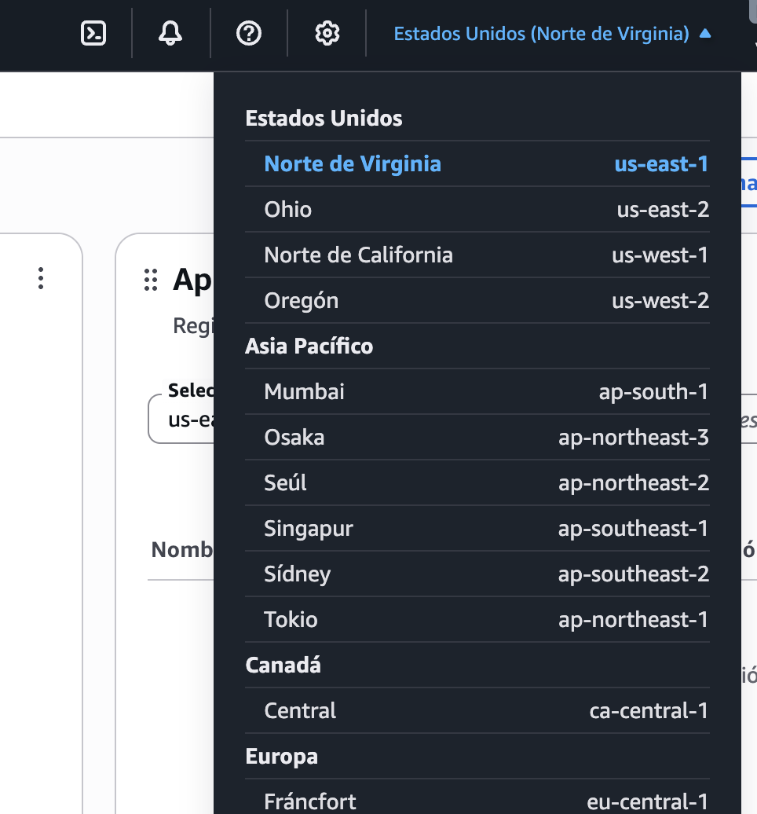

!!! note "Atenció"
    AWS Academy sols té disponible la regió US East (N. Virginia) – `us-east-1` i eventualment US West (Oregon) – `us-west-2` o EU (Ireland) – `eu-west-1` per a la majòria de pràctiques. Les altres estan restringides per al seu ús acadèmic.

---

## Pràctica 2 - Creació de la primera instància EC2

Amb el laboratori en funcionament (recordeu que es va vore a la [pràctica 2 de la unitat 1](u1_practiques.md)), i una vegada dins de la consola gràfica, si fem click en la zona superior esquerra, es despleguen totes les categories de serveis disponibles (podeu consultar-les per curiositat).

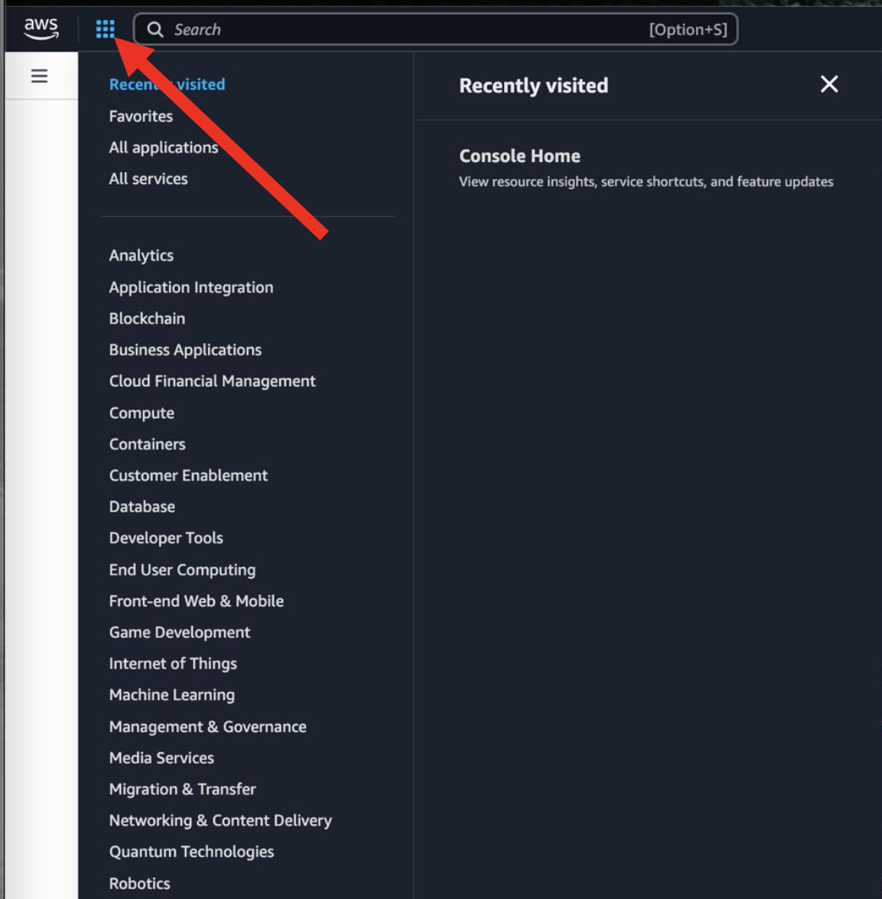

En la barra de búsqueda teclejarem EC2 i podrem marcar el servei com a favorit per a que es quede a la nostra barra de ferramentes ja que es un servei que gastarem durant tot el curs.

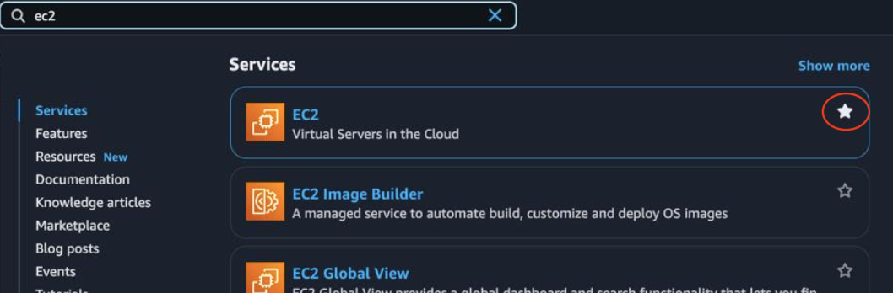

Una vegada seleccionat el servei, se'ns desplegarà el panell de control associat a aquest. Per a començar, li donarem *launch instance*.

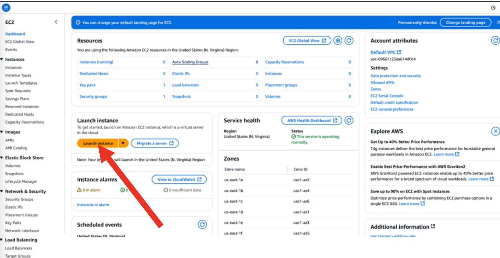

El primer que hem de fer es donar-li un nom a l'EC2 i seleccionar la plantilla (AMI) en la qual basarem la nostra EC2. Ara selccionarem el SO i després una AMI entre les que ens ofereix del SO que hem triat. Per no gastar molts diners (ací hi ha que estar constantment pensar en ahorrar), seleccionarem una AMI de la capa gratuïta (free tier). 

!!! info "Amazon Linux AMI"
    L'Amazon Linux AMI es una distribució Linux creada per Amazon basada en CentOS/RHEL. Si es trobeu més còmodes amb Ubuntu, basada en Debian, no hi ha cap problema en seleccionar una Ubuntu, sempre que siga la capa gratuïta.

Quan seleccionem l'AMI, vorem l'AMI ID (que de moment no el gastarem però en un futur si que ho farem) i l'usuari que ve preconfigurat a la màquina. **Cada SO té un nom d'usuari diferent**.

Ara, triarem el tipus d'instància on ens fixarem principalment en la configuració de CPU, RAM i preu per hora. En el nostre cas, agafarem la **gratuita**.

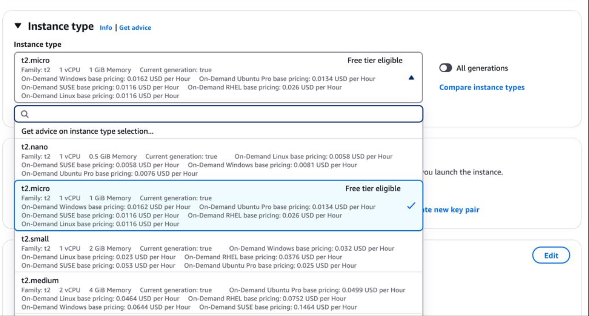

El següent pas es generar una clau privada d'accés o reutilitzar una. De forma predeterminada, al arrancar el laboratori ja se'ns crea una clau anomenada *vockey*. Aquesta clau es el fitxer *.pem* que trobem a l'apartat *AWS Details* en la finestra de creació del lab. Aquest fitxer és la part privada de la clau que necessita el cliente per connectar-se al client (per exemple, mitjançant ssh), ja que la clau pública està instal·lada a la instancia. 
De moment no crearem cap clau ja que gastarem la que ve per defect (vockey). En la següent pràctica s'estudia com accedir per ssh a la instància ja creada i vorem com descarregar-la.

Ara comença un aspecte molt important i és la configuració de seguretat. Es du a terme a través de **grups de seguretat*. Un grup de seguretat no es res més que un firewall que s'associa a la instància EC2 en la que, de forma gràfica, podem configurar regles d'entrada i d'eixida. 

Podem veure que apareix per primera vegada el concepte **VPC** i **subxarxa** que estudiarem a la següent unitat amb detall. Tenint marcada l'opció *Allow SSH Traffic from* i després seleccionat *Anywhere* estem permetent que es puga connectar per SSH desde qualsevol lloc (va per IP). De moment ho deixarem així.

El següent pas és seleccionar l'emmagatzenament del que volem disposar. Per defecte son 8GB que de moment ens sobra.

A la dreta, es apareix el nombre d'instancies que volem llançar amb aquesta configuració. Per defecte és 1 i ho deixarem així.

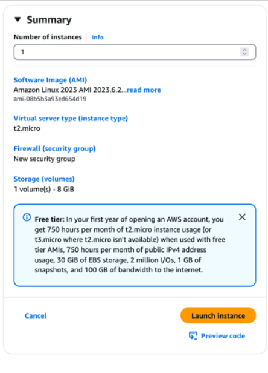

Una vegada tot configurat, podrem llançar la instància i si tot ha anat bé, ens eixira un missatge indicant-ho.

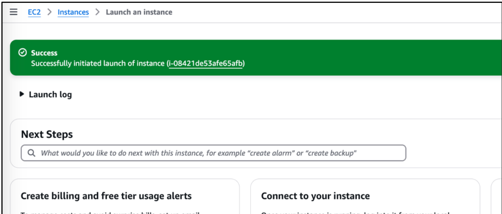

I si fem click en *Instances* al menú lateral, podrem anar directament al panell de control per veure les nostres instàncies i el seu estat.

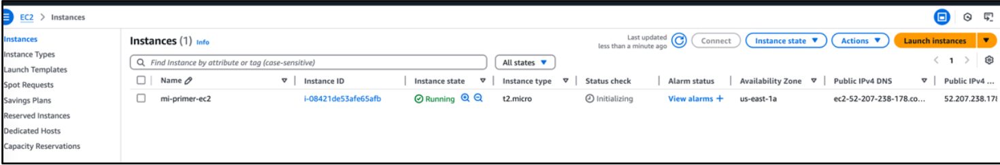

Una vegada ha arrancat la instància (tarda una miqueta), podem veure els detalls d'aquesta així com configurar certes coses vem click en ella. Entre els detalls tenim l'adreça pública (està exposada a Internet i per tant serà la que gastarem per connectar-nos a ella), el seu DNS públic (si volem connectar-se utilitzant nom en lloc de IP) així com l'adreça privada (gastada dins de la xarxa), entre altres

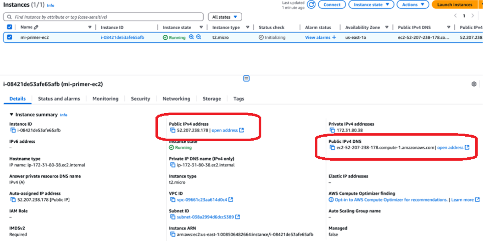

!!! tip "Pràctica sugerida"
    Crea una instància basada en Ubuntu, utilitzant sempre capa gratuita. Examina les opcions que tenim per parar-la, apagar-la, etc.

---

## Pràctica 3 - Connexió a una instància EC2

Una vegada tenim la instància *up and running*, necessitem una forma de connectar-se a ella. Ens centrarem en entorns Linux i més concretament en aquells que no tenen interfície gràfica. 

Per connectar-se per ssh podem fer-ho de dues formes:

- **A través del panell de control**: AWS ens proporciona una interfície amigable des d'on podem connectar-se de forma senzilla a qualsevol de les instàncies que tenim al nostre compte. Per fer-ho, amb la instància seleccionada, anirem al botó *Conectar*

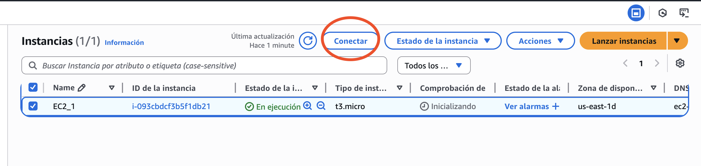

Una vegada la connexió ha sigut establerta, veurem la terminal de la instància a la que ens hem connectat.

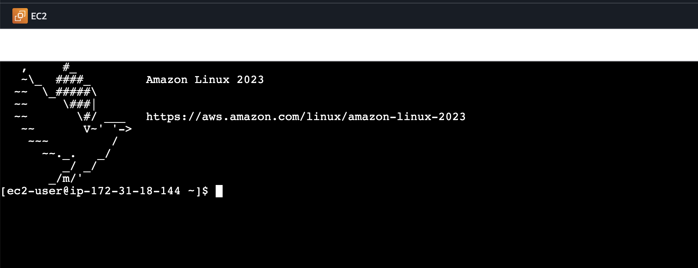

- **A través de un client SSH del nostre SO**: Tant desde Windows, com des de Mac com de Linux es possible connectar-se a les instàncies d'AWS. De fet, en entorns en els que no tenim accés a interfície gràfica i/o navegadors és la forma més utilitzada, a més que és molt més ràpida.

!!! warning "Atenció"
    A l'entregable de la unitat es connectareu a la instància des del vostre SO seguint la documentació oficial.

!!! tip "Pràctica sugerida"
    En aquest punt dels continguts, es recomana fer l'exercici 1 del PAC2 que trobareu a Aules.

---

## Pràctica 4 - Security groups
En aquesta pràctica agafarem com a punt de partida la instància de la pràctica 3 i exercici 1 de la PAC1. Partim d'una instància arrancada que si accedim als grups de seguretat vorem que té dos grups de seguretat assignats:

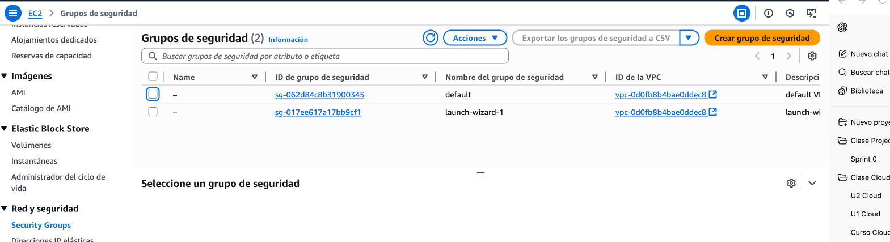

- El grup de seguretat anomenat default ve per defecte amb cada VPC. Si despleguem els detalls d’este grup de seguretat veurem que no utilitza adreces IP, sinó que com a origen té el mateix grup de seguretat.

Això significa que qualsevol instància que tinga associat el mateix grup de seguretat es pot comunicar amb les altres en tots els ports sense cap restricció. Dit d’una altra manera, és una regla de comunicació interna entre instàncies que compartixen eixe grup o VPC. En condicions normals, este grup de seguretat no el modificarem mai.

- El grup de seguretat anomenat *launch-wizard-1* l’hem creat nosaltres en crear la instància, quan en les opcions de seguretat li hem indicat que volem que tots puguen connectar-se per SSH a la nostra instància. És a dir, este grup de seguretat permet que qualsevol IP de tot el món es puga connectar per SSH a esta instància a través de la IP pública de la instància, la qual es pot consultar en els detalls de la instància.

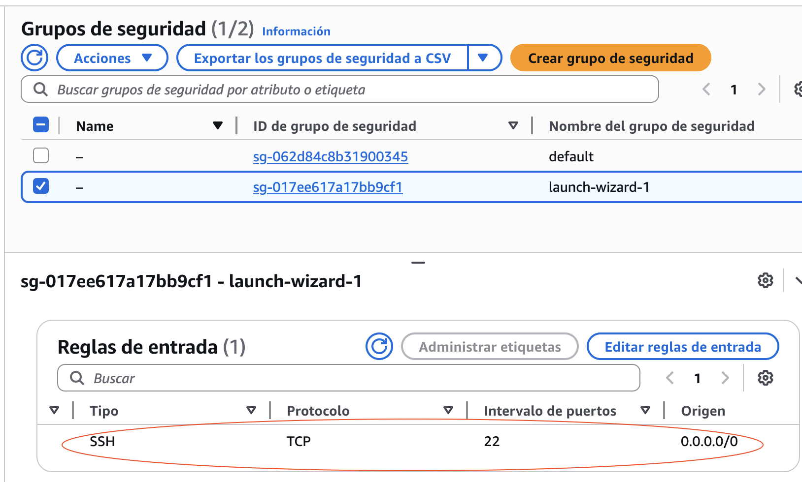

!!! info "0.0.0.0/0"
    Quan la IP es, com en aquest cas, 0.0.0.0/0 fa referència totes les IP. 

### Crear un nou grup de seguretat

Crear un nou grup de seguretat i assignar-lo a una instància és relativament senzill. Després de prémer el botó *Crear grupo de seguridad*, emplenarem el nom que volem donar-li al grup de seguretat, una descripció (opcional) i seleccionarem la VPC en la que volem incloure aquesta regla de seguretat.

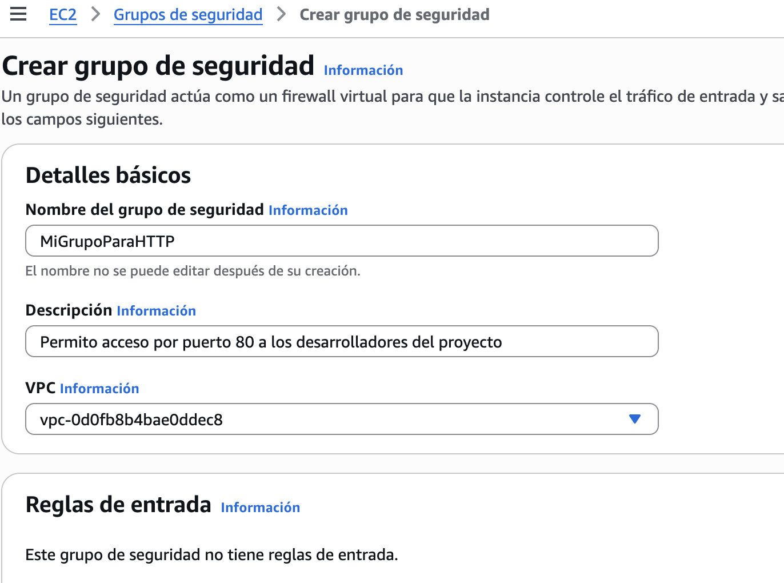

En el nostre cas anem a crear una regla que permeta accedir per http al servidor (per exemple, ser servir una web). 

En aquest punt, seleccionare afegir regla d'entrada i tinc dos opcions, escriure directament el port que vull obrir o seleccionar el servei del desplegable *tipo*

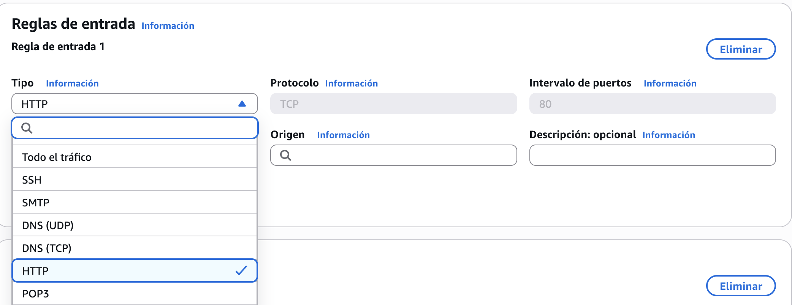

I en *origen* serà on decidirem les IP's a les que volem autoritzar a connectar-se a este port. Si volem que qualsevol puga connectar-se gastarem la 0.0.0.0/0 i si volem que sols siguen certes ip's, el que farem serà incloure les IP's dels PC's que volem que es puguen connectar. En el nostre cas, anem a indicar-li dues ip's específiques a les quals volem permetre la connexió. També hi ha altres opcions com indicar els tipus de IP's o prefixes d'AWS.

!!! info "IP pública"
    Recorda que sempre parlem de les IP's públiques, mai de les IP's privades dels equips. Per coneixer-la teniu moltes webs que vos la diuen però des de terminal, una forma ràpida és executar *curl https://checkip.amazonaws.com*

    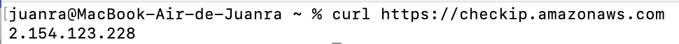

Per tant, si sols volem permetre la connexió des d'aquesta IP, en *origen* posarem la direcció seguit de **/32** que indica que volem que els 32 bits de la IP siguen exactes. Si posem /24, qualsevol IP que tinga els primers 24 bits iguals estarà permesa. Podem afegir tantes IP's com vulguem.

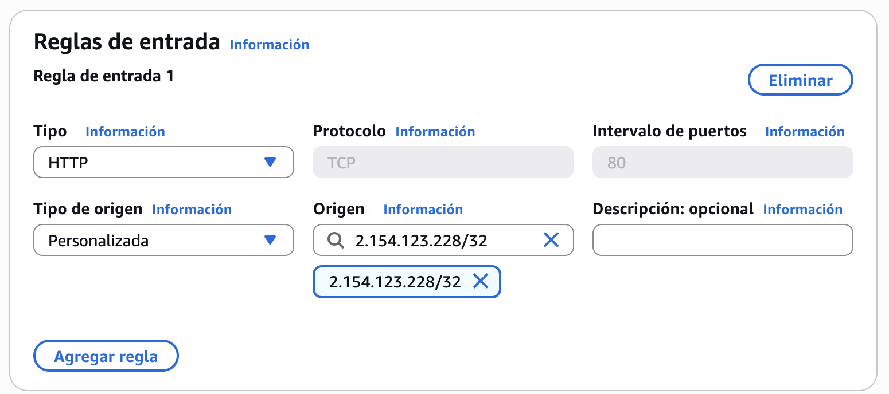

Sols ens quedaria guardar els canvis prement el botó *Crear grupo de seguridad*. 

!!! info "Assignar grup de seguretat"
    Quan creem un grup de seguretat nou, aquest no s'assigna per defecte a cal instància. Cal fer-ho explicitament.

Ara aquest grup de segureta el podem utilitzar tant per assignar-lo a la instància que ja tenim creada com a instàncies noves que creem ja que ens apareixerà en el desplegable de grups de seguretat disponibles.

Per assignar aquest grup de seguretat a la instància ja creada cal anar a la vista de la instància i des de *acciones* seleccionarem l'opció de *Cambiar grupo de seguridad*.

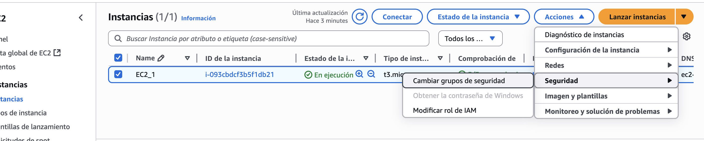

Des d'aquesta vista podrem gestionar els grups de seguretat. Si volem afegir el nostre, el seleccionem i li donem a *Agregar grupo de seguridad*.

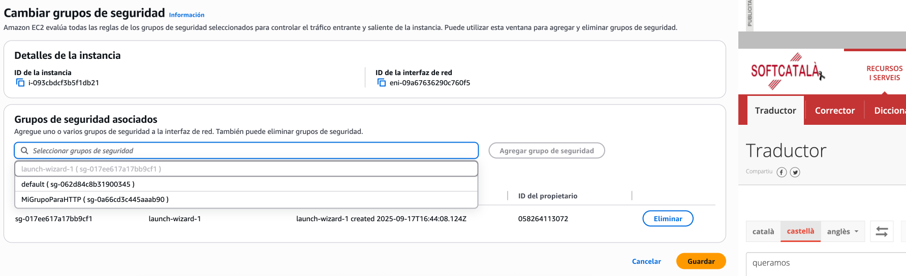

Després de guardar els canvis i uns segons per aplicar-los (AWS **sempre** tarda una miqueta en fer aquests tipus de canvis), veurem si accedim a la pestanya de segureta que el nostre grup està aplicat correctament a la instància, permetent ara mateix connexions SSH des de tots els llocs i per HTTP solament des de la IP del desarrollador.

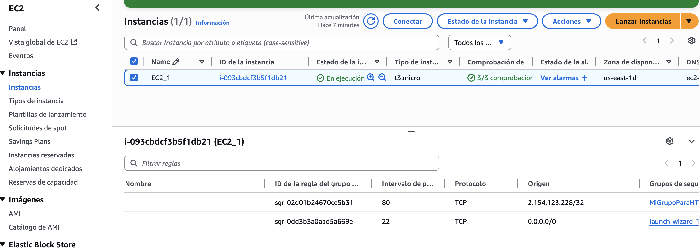

## Pràctica 5 - Creació 

Aquesta pràctica la trobareu en Aules en format vídeo.

---

