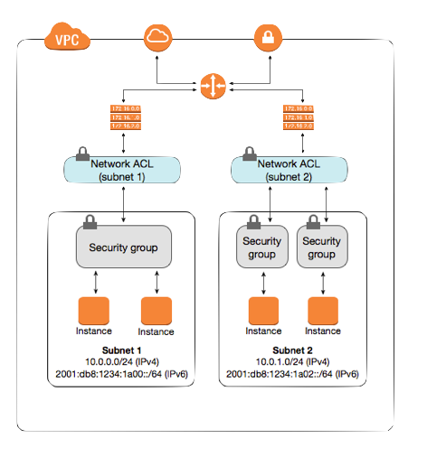

# U3 - 🔐 Xarxes virtuals i serveis de còmput

**🎯 RA's vinculats**: RA2, RA3

## VPC i subxarxes: concepte i desplegament bàsic

!!! tip "Repàs de xarxes"

    Aquesta unitat dona per assolits els coneixements respecte a xarxes, subxarxes i direccionament. Pots trobar un repàs  [ací](../../suport/repasXarxes). 

### Què és una VPC (Virtual Private Cloud)
En AWS, una **VPC** és una xarxa virtual aïllada dins del núvol on pots definir rangs d’adreces IP, subxarxes, rutes i policies de seguretat. És l’equivalent d’un centre de dades virtual, però amb la flexibilitat d’escala, integració i gestió que ofereix el núvol.

Les VPC serveixen per:

- Aïllar recursos (servidors, bases de dades, serveis) en capes segons les necessitats de seguretat i accés.

- Controlar el tràfic entre recursos i vers l’Internet.

- Aplicar polítiques de seguretat (SG, NACL) a nivell de màquina o de subxarxa.

---

### Subxarxes (Subnets)

Una vegada definida una VPC amb un rang CIDR (per exemple 10.0.0.0/16), aquesta es pot subdividir en subxarxes (subnets).

- **Subxarxa pública**: aquella que està associada a una ruta que passa per un Internet Gateway, de manera que les instàncies amb IP pública poden comunicar-se amb Internet.

- **Subxarxa privada**: no té ruta directa a Internet (o només surt via un NAT / instància NAT) i és ideal per recursos que no han d’estar exposats públicament, com aplicacions, lògica de backend o bases de dades.

Cal decidir quantes subxarxes i quins rangs reservar per a cada funció (web, app, base de dades, etc.).

---

### Internet Gateway (IGW) i rutes 

Un Internet Gateway (IGW) és un component que es connecta a la VPC i permet que les instàncies dins de subxarxes públiques facen tràfic cap a Internet (i reben tràfic, si tenen IP pública).
Sense un Internet Gateway, les VPC's no tenen accés a Internet.

!!! info "VPC default"
    La VPC que ve per defecte en AWS sí que ens permet accés a internet perquè **ja te un IGW adjunt**, no hem hagut de crear-lo explicitament però sí que està.

Els IGW van associats als VPC per possibilitar-los la comunicació a internet (que els permeta no vol dir que ho tinguen, cal habilitar-ho també a les instàncies.)

Per poder fer-ho, cada subxarxa d'AWS té associada una *Route table* que determinen com trauen el tràfic. Molt similar a l'enrutament que coneguem del curs passat.

Les taules de rutes (route tables) defineixen quin “destí” (CIDR) es dirigeix a quin “objectiu” (porta de sortida):

- Exemple: la subxarxa pública tindrà una ruta 0.0.0.0/0 → IGW (apareixerà com a igw-xxx) per enviar tot el tràfic no local a Internet.

- La subxarxa privada pot tenir només rutes internes (cap a altres subnets).

!!! tip "Pràctica sugerida"
    En aquest punt dels continguts, es recomana fer la [pràctica 1 de la unitat 3](u3_practiques.md).

!!! tip "Curs AWS Academy Cloud Foundations "
    Una vegada feta les pràctica 1 s'ha de realitzar el mòdul 5 fins al laboratori 2 (*Redes y entrega de contenido*) del curs d' *AWS Academy Cloud Foundations*.

---
## Grups de seguretat (SG) i NACL's

### Security Groups (Grups de Seguretat)

Els grups de seguretat ja s'estudiaren en la unitat 2. Un xicotet repàs:

- Funcionen com un tallafoc virtual a nivell de instància.

- Stateful: si es permet una connexió entrant, la resposta està implícita per a la connexió sortint.

- Es defineixen regles d’entrada (inbound) i regles de sortida (outbound).

- No hi ha ordre de prioritat: es combinen totes les regles per determinar si un paquet és permès o no.

- Exemples típics: permetre SSH (port 22) només des d’adreça IP fixa, permetre HTTP (port 80 / 443) des de qualsevol lloc.

### Network Access Control Lists (NACLs)

Les NACLs actuen a nivell de subxarxa, no d’instància, i són stateless. Açò significa que cal configurar tant les regles d’entrada com les de sortida de manera explícita. A més, les regles tenen un número de prioritat i s’apliquen en ordre.

Les NACLs permeten tindre un control més fi i, sobretot, aplicar polítiques generals a tota una subxarxa. Per exemple, podries bloquejar tot el tràfic ICMP (ping) cap a les subxarxes públiques.

Els NACL's permeten fer bloqueig explícit d'una IP mentre que el SG no ho permet.

| Característica                  | Security Groups (SG)                           | Network ACLs (NACLs)                       |
|---------------------------------|-----------------------------------------------|--------------------------------------------|
| **Nivell d'aplicació**          | S'apliquen a **instàncies** (nivell de NIC/ENI)| S'apliquen a **subxarxes senceres**        |
| **Tipus de filtre**             | **Stateful**: si es permet l'entrada, la resposta ix automàticament | **Stateless**: cada regla d'entrada i eixida s'ha de definir explícitament |
| **Regles per defecte**          | Tot el tràfic denegat fins que s'afegeixen regles | Tot permés per defecte, però es pot denegar |
| **Direccionalitat**             | Inbound i Outbound                            | Inbound i Outbound (independents)           |
| **Prioritat**                   | No hi ha ordre: totes les regles s'avaluen conjuntament | Les regles es processen en **ordre numèric** (de menor a major) |
| **Granularitat típica**          | Més **precís**: es pot aplicar a grup d'instàncies (p.ex. *SG-Web*, *SG-DB*) | Més **global**: afecta totes les instàncies dins la subnet |
| **Flexibilitat**                | Fàcil de reusar: pots assignar el mateix SG a moltes instàncies | Menys flexible: una subnet només pot tindre un NACL actiu |
| **Casos d'ús típics**           | Definir accessos de serveis (ex. Web 80/443, SSH restringit) | “Capa extra” de seguretat: bloquejar IPs concretes, filtres generals de subnet |
| **Exemple pràctic**             | Permetre SSH (22) només des de 203.0.113.5     | Denegar tràfic d'una IP sospitosa a tota la subnet |

### Defensa en capes (Defense in depth)

El més recomanable és utilitzar ambdós mecanismes: SG per protegir cada instància i NACL per filtrar a nivell de subxarxa. D’aquesta manera, si una capa falla, encara tens l’altra.

### Exemple pràctic d'ús conjunt de SG i NACL's:   Arquitectura de 3 capes (Web — App — DB)
 
- Capa Web (subxarxa pública)
    - SG-Web: permet només HTTP/HTTPS (80, 443) des de qualsevol lloc, i SSH només des d’una IP concreta del professor/admin.
    - NACL pública: denega tràfic de certes IPs sospitoses/blocs de països, independentment de SG.

- Capa App (subxarxa privada)
    - SG-App: permet tràfic només des de SG-Web al port 8080 (comunicació web → app).
    - NACL privada (app): denega qualsevol tràfic entrant que no vinga de la subnet pública legítima.

- Capa DB (subxarxa privada)
    - SG-DB: només permet MySQL (3306) des de SG-App.
    - NACL privada (db): segona capa que bloqueja qualsevol cosa que no siga 3306 des de la subnet app.

!!! tip "Exercici sugerit"
    Dibuixa com seria aquesta infraestructura. Per fer-ho, pots gastar [draw.io](https://app.diagrams.net/).

!!! tip "Pràctica sugerida"
    En aquest punt dels continguts, es recomana fer la [pràctica 2 de la unitat 3](u3_practiques.md).

!!! tip "Entregable"
    En aquest punt es recomana realitzar l'exercici 1 de l'entregable d'aquesta unitat disponile a Aules.
    
---

