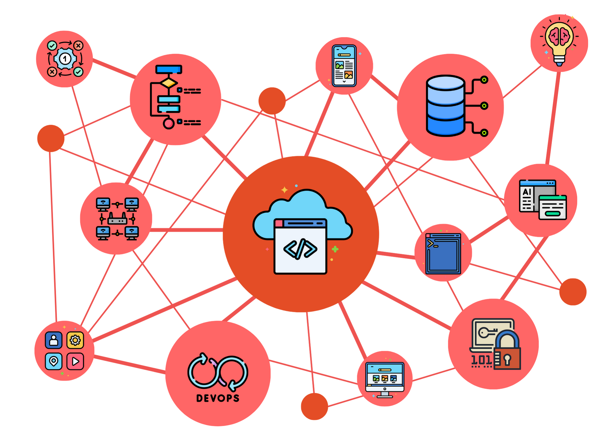

# Benvingut a la meua web

Benvingut/da a la meua web. Aquest espai naix amb la voluntat de ser tant una plataforma de suport docent per a diferents assignatures (DAW, DAM, ASIX) com un lloc personal on compartiré investigacions, reptes i continguts vinculats a altres tecnologies que considere d'interés, encara que no formen part de la docència habitual a l’institut o la universitat.

Mitjançant el menú lateral es pot accedir de manera directa a cada assignatura, temàtica o apartat d’investigació. Trobaràs organitzats els materials, recursos i projectes de cada secció i actualitzaré regularment el contingut amb noves publicacions i recursos.

## Qui sóc?

Em dic Juanra Collado. Sóc de El Perelló, tot i que actualment visc a Gandia.

Sóc enginyer en Informàtica per la Universitat Politècnica de València (UPV), amb un màster en Enginyeria del Programari per la mateixa universitat i un màster en Desenvolupament d’Aplicacions Web per la Universitat Oberta de Catalunya (UOC). 

Abans de dedicar-me a la docència, vaig desenvolupar la meua trajectòria professional com a desenvolupador web i com a desenvolupador Big Data, la qual cosa m’ha aportat una visió pràctica i actualitzada del sector tecnològic.

Actualment, exercisc com a professor a l’IES Maria Enríquez de Gandia i com a professor col·laborador a la Universitat Oberta de Catalunya.

Entre les meues principals inquietuds tecnològiques es troba l’exploració de les possibilitats que ofereixen el cloud computing o la intel·ligència artificial, entre altres.